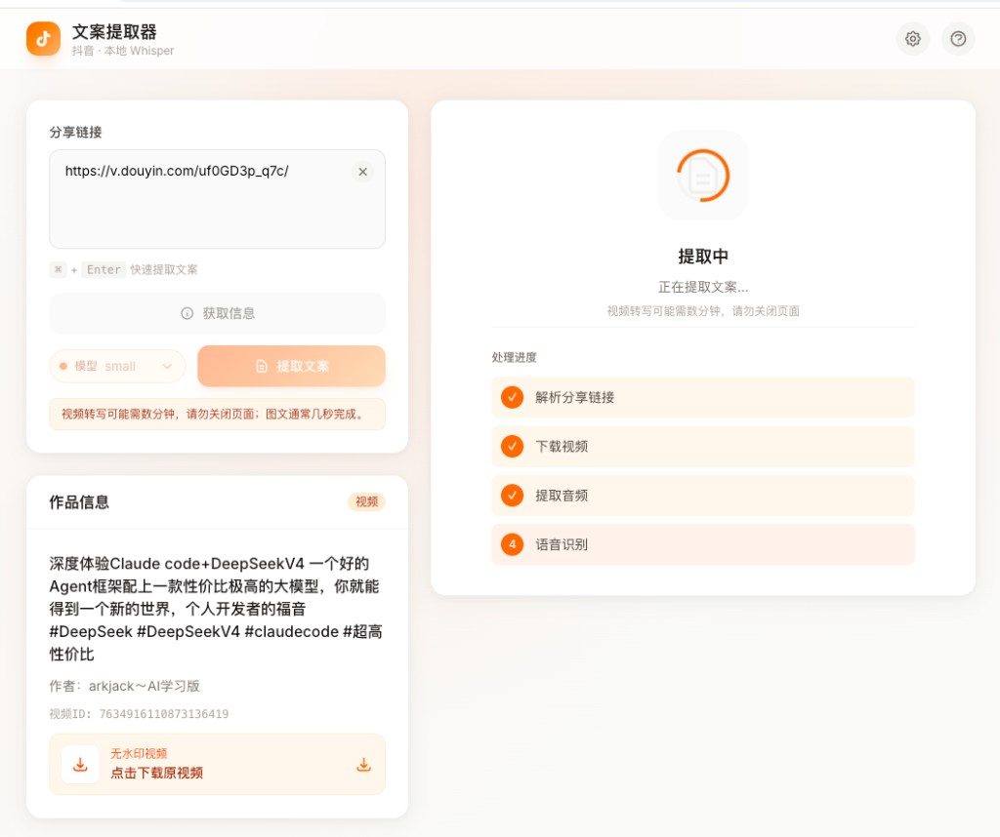
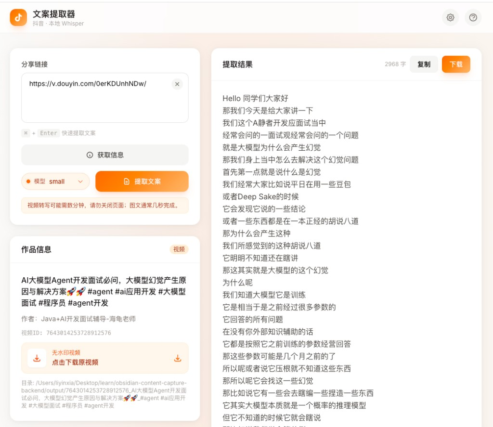

# 抖音内容提取（本地流水线）

从抖音分享链接或整段分享文案，在本地完成解析、下载与文案提取：

- **视频**：无水印下载 → FFmpeg 抽音频 → [faster-whisper](https://github.com/SYSTRAN/faster-whisper) 转写 → [zhconv](https://github.com/Gowee/zhconv) 简体
- **图文（note）**：提取 `desc` 配文并下载配图（不跑 Whisper，不做图片 OCR）

**无需登录 Cookie，无需硅基流动等付费语音 API。**

## 功能

| 能力 | 说明 |
|------|------|
| 链接 | `v.douyin.com` 短链、`www.douyin.com/note\|video`、`iesdouyin.com/share/...`、整段分享文案 |
| 解析 | 分享页 SSR `window._ROUTER_DATA`（备选 `RENDER_DATA`） |
| 下载 | 视频无水印 CDN；图文 `images/01.jpg` … |
| 输出 | 每作品一个文件夹 `output/{作品ID}_{标题}/` |

## 项目结构

```
obsidian-content-capture-backend/
├── script/                 # 核心库 + CLI（插件化时优先依赖此目录）
│   ├── douyin_resolver.py  # 分享页解析
│   ├── pipeline.py         # 主流水线
│   ├── transcriber.py      # Whisper + 简体
│   ├── downloader.py
│   ├── audio_extractor.py
│   └── main.py
├── docs/images/            # README 配图
├── web/                    # Flask Web + JSON API
│   ├── app.py
│   └── templates/index.html
├── main.py                 # 根目录 CLI 入口（自动使用 .venv）
├── run.sh / run-web.sh     # 包装脚本
├── output/                 # 提取结果（运行时生成）
├── requirements.txt
└── .cursor/skills/         # Cursor 开发用 Skill（可选）
```

`测试/` 目录为早期参考脚本，**与当前实现无关**，请勿混用。

## 环境要求

- **Python 3.10+**
- **[FFmpeg](https://ffmpeg.org/)**（仅视频流水线需要抽音频）
- 首次视频转写会从 Hugging Face 下载 Whisper 模型（需联网）

```bash
# macOS
brew install ffmpeg

# Ubuntu / Debian
sudo apt install ffmpeg
```

## 安装

```bash
cd obsidian-content-capture-backend
python3 -m venv .venv
source .venv/bin/activate          # Windows: .venv\Scripts\activate
pip install -r requirements.txt
```

| 依赖 | 用途 |
|------|------|
| `requests` | 请求分享页、下载文件 |
| `faster-whisper` | 本地语音转写 |
| `zhconv` | 繁体 → 简体 |
| `flask` | Web 界面 |

> 若终端是 Conda `(base)` 且报 `No module named 'zhconv'`，请先 `source .venv/bin/activate`，或直接用 `./run.sh` / `python main.py`（会自动尝试 `.venv`）。

## 使用

### Web（推荐）

```bash
python web/app.py
# 或 ./run-web.sh
```

浏览器打开 **http://127.0.0.1:5050**（默认端口；macOS 上 5000 常被 AirPlay 占用）。

#### 使用步骤

1. **粘贴链接**  
   在「分享链接」输入框粘贴抖音短链（如 `https://v.douyin.com/...`）或整段分享文案。支持 `⌘ + Enter`（Windows：`Ctrl + Enter`）快捷提交。

2. **（可选）获取信息**  
   点击 **获取信息**，左侧「作品信息」会显示类型（视频/图文）、标题、作者、作品 ID；视频可在此 **下载无水印原视频**，无需转写时够用。

3. **选择 Whisper 模型**  
   输入框下方选择模型（默认 `small`）。越大越准、越慢；长视频可试 `base` / `tiny` 加快。

4. **提取文案**  
   点击 **提取文案**，开始完整流水线。右侧出现「提取中」与四步进度：
   - 解析分享链接 → 下载视频 → 提取音频 → 语音识别（图文作品跳过转写，通常几秒完成）

   

   > 视频转写可能需数分钟，请勿关闭页面；终端需保持 `python web/app.py` 运行。

5. **查看与导出结果**  
   完成后右侧「提取结果」显示简体文案与字数，可 **复制** 或 **下载** `transcript.txt`；本地文件在 `output/{作品ID}_{标题}/`。

   

#### 界面说明

| 区域 | 作用 |
|------|------|
| 分享链接 | 输入 URL 或分享文案，选择模型并触发提取 |
| 作品信息 | 解析后的元数据；视频可单独下载无水印 MP4 |
| 提取中 / 提取结果 | 实时进度与最终文案（复制、下载） |

指定端口：`PORT=8080 python web/app.py`

### 命令行

```bash
# 任选一种（均建议在项目根目录执行）
python main.py "https://v.douyin.com/xxxxx/"
python -m script "https://v.douyin.com/xxxxx/"
./run.sh "https://v.douyin.com/xxxxx/"

# 图文 note 页
python main.py "https://www.douyin.com/note/7640701464617132402"

# 整段分享文案（内含短链即可）
python main.py "7.48 复制打开抖音… https://v.douyin.com/xxxxx/ …"

# 交互输入（无参数时从 stdin 读取）
python main.py

# 指定 Whisper 模型（仅视频）
python main.py --model base "https://v.douyin.com/xxxxx/"
```

可选参数：`--output`、 `--device`、`--compute-type`（见 `python -m script --help`）。

## 输出结构

**视频：**

```
output/{作品ID}_{标题}/
├── video.mp4
├── audio.wav
├── download_url.txt
├── transcript.txt
├── transcript_segments.json
└── meta.json
```

**图文：**

```
output/{作品ID}_{标题}/
├── images/01.jpg …
├── image_urls.txt
├── transcript.txt
└── meta.json
```

`transcript.txt` 含元数据头与 `--- 文案 ---` 分隔的正文。

## HTTP API（供集成 / 插件参考）

| 方法 | 路径 | 说明 |
|------|------|------|
| `GET` | `/api/health` | 健康检查，本地 Whisper |
| `POST` | `/api/video/info` | JSON `{ "url": "..." }`，仅元数据 |
| `POST` | `/api/video/extract` | JSON `{ "url": "...", "model": "small" }`，完整流水线 |
| `GET` | `/api/video/download` | 查询参数 `url`、`filename`，代理下载视频 |
| `GET` | `/files/<path>` | 访问 `output/` 下已生成文件 |

## 在代码中调用

```python
from script.config import Settings
from script.douyin_resolver import resolve_douyin_share
from script.pipeline import process_douyin_share

# 仅解析，不下载、不转写
meta = resolve_douyin_share("https://v.douyin.com/xxxxx/")
print(meta.title, meta.content_type, meta.download_url)

# 完整流水线
out_dir = process_douyin_share(
    "https://v.douyin.com/xxxxx/",
    settings=Settings(whisper_model="small"),
)
```

## 技术说明

| 环节 | 实现 |
|------|------|
| 解析 | 移动端 UA 打开 `iesdouyin.com/share/...`，读 SSR JSON；`www.douyin.com/note\|video` 会自动转换 |
| 无水印 | `play_addr` → `play` 端点（`playwm` → `play`） |
| 视频文案 | CDN 下载 → FFmpeg 16kHz wav → faster-whisper → zhconv |
| 图文文案 | 直接使用 `desc`；图片直链批量下载 |

## 常见问题

| 现象 | 建议 |
|------|------|
| 解析失败 | 检查链接；`note`/`video` 页需能转到 `iesdouyin.com/share/...` |
| 视频很慢 | CPU + `small` 模型下长视频数分钟正常，可试 `tiny` / `base` |
| 终端 `float16 → float32` | CPU 上 ctranslate2 自动降级，可忽略 |
| Web 长时间无响应 | 同步处理中，视频转写完成前页面不会更新 |
| 配图无文字 | 题本在图片里，当前未做 OCR |

## Obsidian 插件

配套插件：[obsidian-douyin-capture](https://github.com/lyxdream/obsidian-douyin-capture)。插件与后端的 API / Vault 约定见插件仓库 [`docs/obsidian-plugin-contract.md`](../obsidian-douyin-capture/docs/obsidian-plugin-contract.md)。

## 后续规划

业务逻辑集中在 `script/`，计划通过 adapter（MCP / 子进程 / Obsidian 等）对外提供插件能力；`web/` 仅作演示与本地调试。

## 许可与声明

仅供学习与研究。请遵守相关法律法规与平台规则，勿用于侵权或违法用途。
